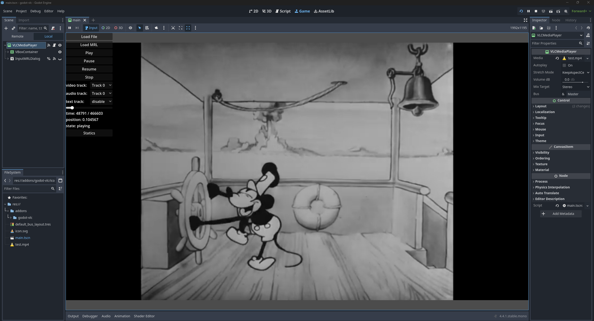

# godot-vlc

VLC extension for Godot. Supports Godot 4.3 and newer.

## How to use
Put media files into `res://` and they will be loaded as `VLCMedia`. Then you can play them with `VLCMediaPlayer` node.

You can alse use `VLCMedia.load_from_file()` to load media from disk or `VLCMedia.load_from_mrl()` to load media from a [media resource locator](https://wiki.videolan.org/Media_resource_locator).

There are some other features, such as subtitles and chapters, can be accessed through scripts. For more information, see the ingame documentation.

## Screenshot

