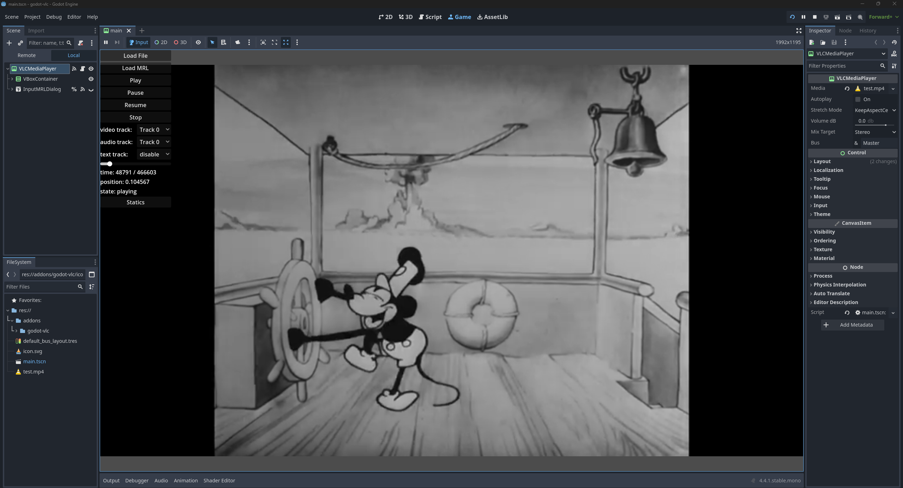

# godot-vlc
[](https://godotengine.org/asset-library/asset/3766)
[![Dynamic JSON Badge](https://img.shields.io/badge/dynamic/json?url=https%3A%2F%2Fstore.godotengine.org%2Fapi%2Fv1%2Freleases%2Fcunpu-fan%2Fvlc%2F&query=%24%5B0%5D.version&logo=data%3Aimage%2Fsvg%2Bxml%3Bbase64%2CPHN2ZyB4bWxucz0iaHR0cDovL3d3dy53My5vcmcvMjAwMC9zdmciIHZpZXdCb3g9IjAgMCA0MDAgNDAwIj48cGF0aCBmaWxsPSIjZmZmIiBmaWxsLXJ1bGU9ImV2ZW5vZGQiIGQ9Ik02My45IDk4LjRIMzM1LjFWMzgySDYzLjlaIE0xMjMuOSA1My40QTMzLjggMzMuOCAwIDAgMSAxNTcuNyAxOS41SDI0MS4zQTMzLjggMzMuOCAwIDAgMSAyNzUuMSA1My40Vjk4LjRIMjQ1LjRWNDkuMkgxNTMuNlY5OC40SDEyMy45WiBNMTYxLjQgMjE1LjZBMjEuMSAyMS4xIDAgMSAwIDExOS4yIDIxNS42QTIxLjEgMjEuMSAwIDEgMCAxNjEuNCAyMTUuNlogTTI3OS45IDIxNS42QTIxLjEgMjEuMSAwIDEgMCAyMzcuNiAyMTUuNkEyMS4xIDIxLjEgMCAxIDAgMjc5LjkgMjE1LjZaIE0zMzMuNCAyNjkuN0wzMzIuNyAyNjYuOEwyOTAuOSAyNzEuOEwyODMuMSAyNzkuOEwyODEuNiAzMDAuN0wyNDAuNCAzMDMuN0wyMzcuNiAyODQuN0wyMjkgMjc3LjNIMTcyLjhMMTY0LjIgMjg0LjdMMTYxLjQgMzAzLjdMMTIwLjIgMzAwLjdMMTE4LjcgMjc5LjhMMTEwLjkgMjcxLjhMNjYuMyAyNjYuN0w2NS42IDI2OS42TDY1LjUgMjc5LjhMMTAxLjkgMjg2LjlMMTAzLjQgMzA4LjFMMTExLjQgMzE2LjFMMTY4LjIgMzIwLjFMMTY4LjggMzIwLjJMMTc3LjQgMzEyLjhMMTgwLjMgMjkzLjJIMjIxLjVMMjI0LjQgMzEyLjhMMjMzIDMyMC4yTDIzMy42IDMyMC4xTDI5MC40IDMxNi4xTDI5OC40IDMwOC4xTDI5OS45IDI4Ni45TDMzMy41IDI3OS44TDMzMy40IDI2OS43WiIvPjwvc3ZnPg%3D%3D&label=asset%20store&labelColor=333639)](https://store.godotengine.org/asset/cunpu-fan/vlc/)

VLC extension for Godot. Supports Godot 4.3 and newer. Supports Windows, Linux and
Android.
## How to use
Put media files into `res://` and they will be loaded as `VLCMedia`. Then you can play them with `VLCMediaPlayer` node.

You can also use `VLCMedia.load_from_file()` to load media from disk or `VLCMedia.load_from_mrl()` to load media from a [media resource locator](https://wiki.videolan.org/Media_resource_locator).

Subtitles are resources too. A `.srt`, `.ass`, `.ssa`, `.vtt`, `.sub`, `.smi` or `.ttml` file inside `res://` is imported as a `VLCSubtitle`, and one from anywhere else can be built with `VLCSubtitle.load_from_file()` or `VLCSubtitle.load_from_mrl()`. Either can be handed to `VLCMedia.add_subtitle()` before the media is assigned to a player, or to `VLCMediaPlayer.add_subtitle()` while it is playing; `set_spu_delay_us()` and `set_spu_text_scale()` adjust subtitles that are out of step or too small. VLC's per-media options go through `VLCMedia.add_option()`.

Chapters and titles are read back by name. `VLCMediaPlayer.get_full_chapter_descriptions()` gives one dictionary per chapter -- `name`, `time_offset`, `duration` -- and `get_full_title_descriptions()` one per title -- `name`, `duration`, `flags`; both lists belong to the input rather than to the media, so both are empty until something is playing, and `chapter_changed`, `title_list_changed` and `title_selection_changed` announce what moves in them. `get_chapter()`, `set_chapter()`, `next_chapter()` and `previous_chapter()` are the libvlc names for moving.

There are some other features, such as statistics, that can be accessed through scripts. For more information, see the in-editor documentation.

## Screenshot


## Supported platforms

| Platform | Status |
|---|---|
| Windows x64 | supported |
| Linux x64 | supported; requires glibc 2.35 or newer |
| Android arm64 (`arm64-v8a`) | supported; requires Android 7.0 (API 24) or newer |
| macOS, Linux arm64, Windows arm64, Android armeabi-v7a and x86_64 | not supported |

Nothing has to be installed on the user's machine: the addon ships its own
LibVLC and does not use a system VLC. The Linux requirement above comes from how
the extension is built, not from a choice in the code; the bound is recorded in
`build/vlc/glibc-baseline.txt` and enforced by `scripts/check_glibc_floor.ps1`.

The Android runtime differs from the two desktop ones in ways that are visible
from a game: it is a single monolithic `libvlc.so` with every module linked into
it, because Android will not load a plugin tree out of an application's assets,
so there is no `libvlccore.so` and no `plugins/` directory to go with it. Video
reaches Godot through the software `vmem` output -- frames are decoded to memory
and uploaded to a texture -- because LibVLC 4 has no Android engine for the
output-callbacks API the Windows GPU path uses. Everything under `res://` is
handed to LibVLC as an in-memory buffer, so no media is ever unpacked to disk.

## Building from source

Two tools have to be present, and the setup script reports rather than installs
them:

- **Rust**, at the version `rust-toolchain.toml` pins. rustup reads that file
  automatically; if the toolchain is missing,
  `rustup toolchain install <version> --component rustfmt --component clippy`
  fetches it. The pin is deliberate: clippy's lints change between releases and CI
  builds with `-D warnings`, so an unpinned toolchain turns somebody else's
  compiler upgrade into a build failure here.
- **libclang**, because the LibVLC bindings are generated by bindgen. Set
  `LIBCLANG_PATH` to the directory holding it. On Windows, install Visual Studio
  with the C++ workload as well.

The LibVLC runtime is then either downloaded from CI or built here in a
container. A container build takes one to two hours from cold, so it is never
started on its own: a failed download reports the command instead.

```sh
pwsh scripts/setup.ps1           # check this machine, then obtain the runtime

# the same steps, separately
pwsh scripts/setup.ps1 check     # prerequisite report, with versions
pwsh scripts/setup.ps1 stage     # fetch the artifact CI built, or use a local one

# build the runtime here instead (explicit; one to two hours). stage then picks
# up what it produced in artifacts/
pwsh scripts/setup.ps1 libvlc

pwsh scripts/setup.ps1 debug     # compile the extension, debug only
pwsh scripts/setup.ps1 release   # release only
pwsh scripts/setup.ps1 build     # both, which is what addon needs: the manifest
                                 # declares the debug and release libraries
pwsh scripts/setup.ps1 test      # unit tests
pwsh scripts/setup.ps1 addon     # assemble the addon, then run the gates
pwsh scripts/setup.ps1 accept    # decode a real H.264 file through the addon
pwsh scripts/setup.ps1 reset     # delete the generated directories
```

The Android runtime is a separate build, because VLC's Android build system is
not the one in `build/vlc/`: it drives the NDK into a single monolithic
`libvlc.so` instead of autotools into a modular tree. It runs in its own
container, the same way the desktop ones do.

```sh
docker build -f build/vlc-android/Dockerfile -t godot-vlc/vlc-android-build build
docker run --rm -v "$PWD/artifacts:/out" godot-vlc/vlc-android-build arm64-v8a /out

pwsh scripts/stage_libvlc.ps1 -Platforms android-arm64
```

`build/vlc-android/README.md` explains what that build has to do differently from
upstream, and why: the runtime VideoLAN publishes has no dummy vout window module
and no licence this repository can ship. Building the *extension* for Android also
needs the NDK (r28 or r29, the Linux one) and
`rustup target add aarch64-linux-android`; `scripts/host-provided-libs-android.txt`
records which libraries Android itself is expected to supply.

Fetching is not a shortcut around verification. The artifact is the one CI built
and ran its own acceptance test against, its `build-info.txt` is checked against
the pinned revision in `build/vlc/vlc.lock` before anything is unpacked, and the
unpacked tree is checked for the SONAME links a flattened extraction would have
turned into copies. `stage` needs the [GitHub CLI](https://cli.github.com) logged
in for the download, or Docker for `libvlc`, and it names which one is missing
rather than doing either silently.

Every step runs the same script CI runs, with the same arguments. The only thing
more permissive here is the prerequisite report above: a missing Godot does not
affect building or testing anything.

`scripts/check_addon.ps1` asserts that every file the addon ships is declared in
the `.gdextension` manifest, that nothing in it exists only to build something,
and that every shared object's dependencies resolve either inside the addon or
against a library the host is guaranteed to provide.
`scripts/acceptance_test.ps1` then decodes a real H.264 file **from the assembled
addon**, through LibVLC directly rather than through the `vlc` command-line tool
(which is not shipped), and fails if any plugin failed to load. See
`build/vlc/README.md` for the build environment, the pinned revision and the
measured state of both platforms.

Android cannot be checked that way, because the answer lives on a device:
`scripts/acceptance_test_android.ps1` builds, assembles, exports, installs and
then asserts from the device's own log that LibVLC opened the `vmem` video
output. That is the memory output, the only one the extension can turn into a
texture, and a runtime without it plays audio and shows nothing.

Common failures, and what they mean:

| Message | Meaning |
|---|---|
| `'thirdparty/vlc/...' is missing` | The runtime has not been staged. Run `setup.ps1 stage`. |
| `... is missing but the manifest declares ...` | The runtime is incomplete: a file the package must ship is absent. |
| `... is neither shipped nor in the host-provided list` | A module depends on a library the addon does not carry and the host may not have. This is the failure that made the previous Linux runtime unusable. |
| `present in the addon but not declared` | The manifest and the runtime have drifted apart, and Godot would not export that file. |
| `shipped a file that only exists to build something` | Build residue reached the package, such as the libtool archives the mingw module tree carries. See `scripts/forbidden-in-addon.txt`. |
| `unpacked lib/... as a regular file` | The tar that unpacked the runtime does not recreate symlinks. Windows' own `tar` does; msys64's GNU tar writes copies instead. |
| `cannot obtain the LibVLC runtime` | Neither an artifact nor a way to fetch one is available. Run `setup.ps1 libvlc`, or place `artifacts/vlc-<platform>.tar.gz` yourself. |

## Known limitations

- The runtime ships every plugin VLC builds, including video outputs and screen
  capture this extension never uses. Pruning them is not done yet; they are what
  the X11 entries in `scripts/host-provided-libs.txt` are for.
- The Linux extension and the bundled LibVLC runtime are both built on ubuntu
  22.04, so both require glibc 2.35. `build/vlc/glibc-baseline.txt` records the
  bound and `scripts/check_glibc_floor.ps1` enforces it across the whole runtime.
- The Android runtime is monolithic, so a module cannot be added or removed
  without rebuilding it. That is also why the build has to intervene on
  `libvlcjni`'s module blacklist: the vmem output this extension renders through
  needs the dummy *vout window* module, and the access module behind `imem://` is
  what lets media inside `res://` be played at all.
- Android video goes through the software `vmem` output only. LibVLC 4 offers no
  Android engine for the output-callbacks API, so there is no zero-copy path to
  compare with the Windows D3D11 one; frames are copied to memory and uploaded.
- Android is built for `arm64-v8a` alone. `armeabi-v7a` and `x86_64` are not
  built, so an x86_64 emulator cannot run the addon.
- The Android runtime and the extension are both built for 16 KB memory pages,
  which Android 15 and later require; a runtime built elsewhere may not be.
- The bundled runtimes are stripped of debug information. VLC is built with `-g`
  and nothing removed the result, so the addon used to ship it: 666 MB of the
  Linux runtime's 798 MB of shared objects and 827 MB of the Windows runtime's
  1026 MB were `.debug_*` sections, and the packed Linux runtime was 307 MB where
  the same tree stripped is 53 MB. The trade is that a crash inside LibVLC has no
  symbols here; `build/vlc/postprocess.ps1` records the reasoning.
- `smb://` and `cifs://` reach SMBv1 shares through libdsm, which the desktop
  runtimes enable with `--enable-libdsm` and the Android runtime enables as part
  of VideoLAN's own buildsystem. There is no SMB2/3 client on the desktop
  runtimes: VLC's `smb2` module needs libsmb2, and contrib has no package for it.
  The Android runtime is built by the other buildsystem and carries both.
- macOS, Linux arm64 and Windows arm64 are not supported.


## Licensing

This library is LGPL-2.1-or-later; see `LICENSE`.

The bundled LibVLC runtime is built with `contrib/bootstrap --disable-gpl
--enable-ad-clauses`, and *without* `--disable-gnuv3` — GnuTLS and the rest of
the version-3 (L)GPL tier are admitted because contrib defaults that switch to
on, and `--enable-gnuv3` is not a spelling it accepts. `contrib/bootstrap`
reports the result as *"Lesser GPL version 3, with advertisement clauses"*. The
Android runtime builds the same combination through `libvlcjni`'s `--license l`
mode; the two lines have to agree, because a runtime that is LGPLv2.1 on one
platform and LGPLv3 on another is a licence statement nobody can make. The
extension itself stays LGPL-2.1-or-later — the LGPLv3 part is the runtime it
links.

`--disable-gpl` is what keeps the GPL packages out, and it stays on: x264 and
x265 are encoders a player does not need (H.264, VP9 and AV1 *decoding* goes
through avcodec and dav1d), DVD access is GPL, and `aribb24` — the only package
gated on *both* switches — is excluded by it as well. `--enable-ad-clauses` is
not optional: freetype is the only package in contrib gated on it, and freetype
is VLC's subtitle and OSD text renderer.

Not passing `--disable-gnuv3` is not optional either, because that tier is the
only way to get TLS here. GnuTLS is the only cross-platform provider of LibVLC's
`tls client` capability, and contrib builds it only when version-3 (L)GPL code is
allowed, since its crypto backend (`nettle`, then `gmp`) is LGPLv3+/GPLv2+ and
cannot be used under LGPLv2.1. Measured on the previous win-x64 runtime, **0 of
383 plugins** carried `tls client`, so nothing over TLS could be opened at all.
The same switch brings three more packages, each for a reason of its own:

- `live555`, itself LGPLv3-or-later — 444 of its 447 source files grant "version
  3 … or later" — which is what serves RTSP properly.
- `srt`, whose contrib rule pins `-DUSE_ENCLIB=gnutls` and so needs the same
  backend.
- `asdcplib`, admitted by this switch rather than by a `GPL` one (its gate reads
  `if GPL … else if GNUV3`) because it is built against nettle. Its own licence
  is BSD-style ("Redistribution and use in source and binary forms"), and the VLC
  DCP module it enables is LGPL-2.1-or-later like the rest of the tree, so it
  adds a capability — Digital Cinema packages — and no licence obligation of its
  own. Android does not get it: that rule skips the platform.

What LGPLv3 changes for whoever bundles this runtime, and what it does not:

- Games are unaffected. LGPLv3 is still a *weak* copyleft: an application that
  links the library keeps its own licence and its own source stays closed.
- The runtime ships as separate shared libraries (`.dll`/`.so`, and a separate
  `libvlc.so` on Android), which is the "suitable shared library mechanism" of
  LGPLv3 §4(d)(1); the duties that come with it are passing on the notices and
  licence texts and letting the user replace the library.
- LGPLv3 §4(e) requires Installation Information only where GPLv3 §6 would:
  when the work is conveyed in or with a **User Product**. A game shipped on PC
  is not one — the player can replace the DLL — but a locked console, handheld
  or embedded target is.
- LGPLv3 is **not compatible with GPLv2-only** projects, where LGPLv2.1 was, and
  it adds the patent (§11) and no-further-restrictions (§4, GPLv3 §10) terms.

The desktop runtimes pass one flag that is not a licence switch at all:
`--enable-libdsm`. libdsm is an *opt-in* contrib package — its rules never add
themselves to `PKGS` — and VLC builds its SMB/CIFS access module only when the
library is present, so without the flag `smb://` had no client here. Its licence
is LGPLv2.1-or-later ("liBDSM is released under LGPLv2.1 (or later)"), and the
two GNU libraries it links statically, libtasn1 4.19.0 and libiconv 1.18, carry
LGPL-2.1 `COPYING` files: all three sit inside the set above. VideoLAN's own
Android buildsystem already enables it, so this brings the desktop runtimes to
the same feature set rather than adding one only they have.
